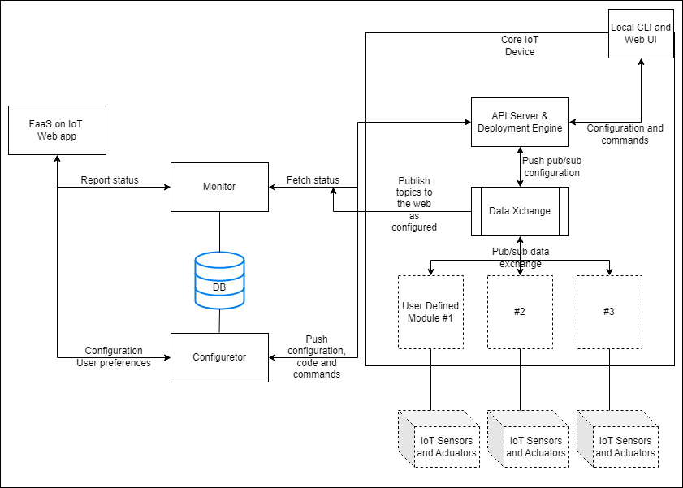

# FaasOnIoT

## Overview

## Code merging etiquette(TODO: Move to an appropriate location in docs/)
1. No direct pushes to `master`.
2. Each PR must have two approving reviews before being merged into `master`.
3. Each PR must have only the minimum required number of commits, ideally, one per PR. Please rebase and combine commits as appropriate.
4. Each PR must focus on a code update that is a single independent logical unit. PRs with a wide scope and too many changes are difficult to review and judge.